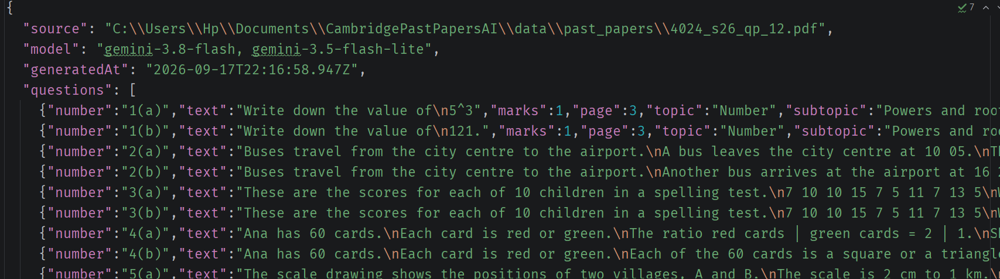

# CambridgePastPapersAI

Turns Cambridge past paper PDFs into structured JSON, one record per question, powered by Gemini.


Text is extracted page by page with its layout coordinates intact, which is what
makes it possible to strip headers, footers, margin text and answer lines, and to
find question boundaries like `1`, `1(a)`, `1(a)(i)`. Only the resulting question
candidates are sent to Gemini, as compact JSON. The PDF itself is never uploaded.

Instead of uploading limit-intensive PDFs, you can now just copy-paste the JSON into ChatGPT. If you need this, hopefully you get an A*!

## Preview




## Setup
```powershell
npm install
copy .env.example .env
```

Put your Gemini API key in `.env`.

```powershell
npm run dev
```

## Output

Input subdirectories are mirrored, so papers with the same filename don't collide:

```text
data/
├── past_papers/
│   ├── maths-paper-1.pdf
│   └── physics/
│       └── mechanics.pdf
└── parsed_papers/
    ├── maths-paper-1/
    │   ├── extracted-pages.json
    │   └── questions.json
    └── physics/
        └── mechanics/
            ├── extracted-pages.json
            └── questions.json
```

`questions.json` holds the normalized questions. `extracted-pages.json` is the raw
page text plus fragment coordinates, kept for debugging. If Gemini fails, the paper
directory keeps its manifest and gets a `question-extraction-error.json` instead.

A paper's output directory is deleted and rebuilt on every run, so stale files
can't survive a replaced PDF.

## What comes from where

Question text, numbering, page numbers and printed mark allocations all come from
the local extraction. Gemini only supplies `topic`, `subtopic`, `questionType`, and
marks when none were printed. Its responses are schema-constrained, checked against
the candidate IDs that were sent, and validated with Zod; wording it returns that
isn't backed by the source text is discarded.

## Settings

All optional except the API key. Defaults shown.

```dotenv
GEMINI_API_KEY=
GEMINI_MODEL=gemini-3.8-flash
GEMINI_FALLBACK_MODELS=gemini-3.5-flash-lite,gemini-2.5-flash,gemini-3.6-flash
GEMINI_BATCH_SIZE=40
GEMINI_MAX_RETRIES=3
GEMINI_REQUEST_DELAY_MS=3000
PAST_PAPERS_DIR=data/past_papers
PARSED_PAPERS_DIR=data/parsed_papers
```

Each retry moves to the next fallback model, and rate-limit delays returned by the
API are honoured.

## Layout

```text
src/
├── cli.ts                          # entry point
├── pipeline/ingest-papers.ts       # per-paper orchestration
├── pdf/
│   ├── pdf-document.ts             # loading and lifecycle
│   ├── extract-pages.ts            # text + coordinates per page
│   └── text-layout.ts              # fragments to lines, x^2 and T_n notation
├── questions/
│   ├── segment-questions.ts        # question boundaries, boilerplate removal
│   └── build-questions.ts          # merge local text with model metadata
├── llm/gemini-question-extractor.ts
├── schema/question.ts              # Zod schemas, source of truth for types
└── output/                         # serializers
```

## Checks

```powershell
npm run typecheck
npm test
```
